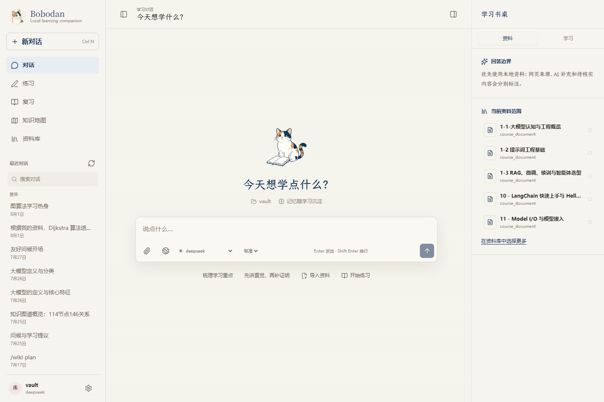
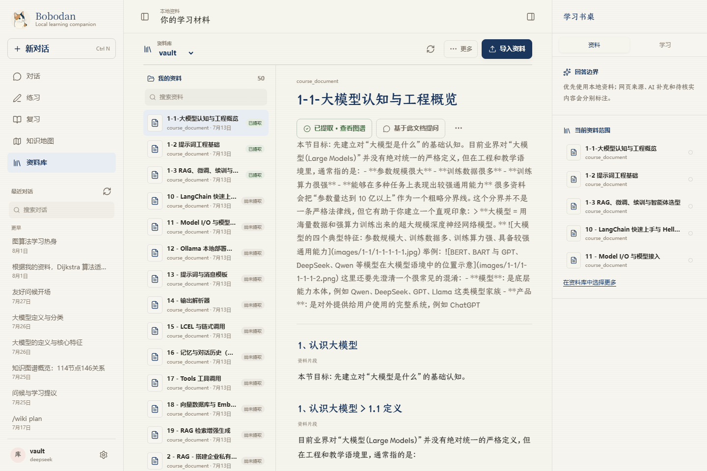
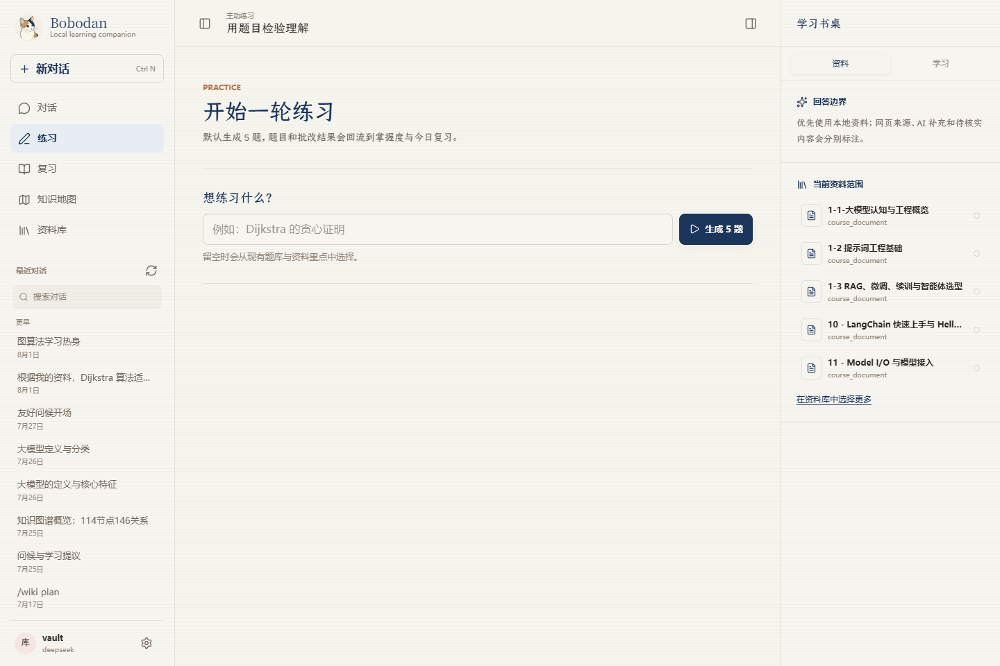
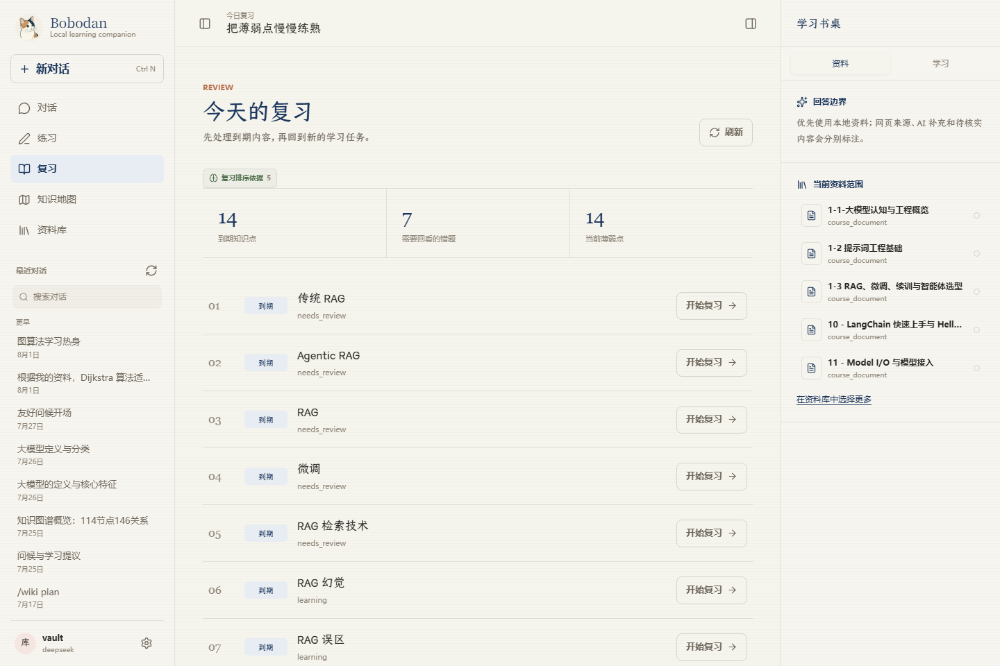
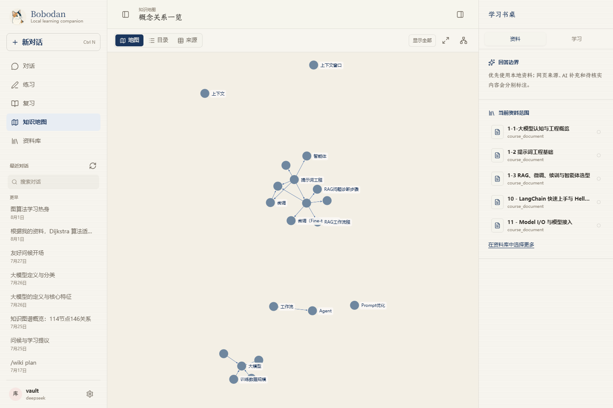
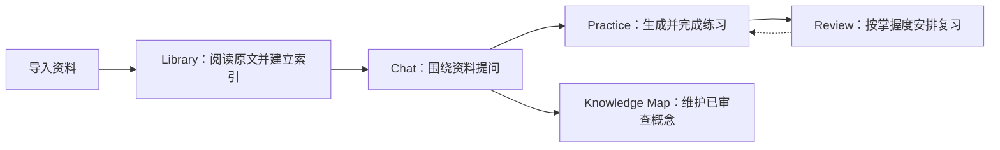
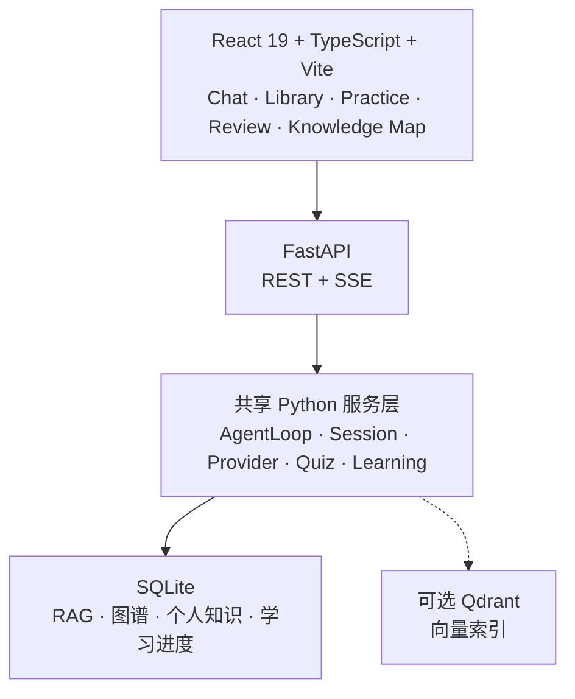

<a id="readme-top"></a>

<div align="center">

# 波波蛋 · Bobodan

<p><strong>把自己的资料，变成一条可追踪的学习路径。</strong></p>

<p>本地优先 · 对话入口 · 来源边界 · 练习与复习闭环</p>

<p>
  <a href="https://react.dev/"></a>
  <a href="https://www.typescriptlang.org/"></a>
  <a href="https://vite.dev/"></a>
  <a href="https://fastapi.tiangolo.com/"></a>
  <a href="https://www.sqlite.org/"></a>
</p>

<p>
  <a href="#screenshots">界面预览</a> ·
  <a href="#features">核心能力</a> ·
  <a href="#quick-start">快速开始</a> ·
  <a href="#data-boundaries">数据边界</a> ·
  <a href="#docs">文档</a>
</p>

</div>

<a id="screenshots"></a>

## 界面预览

下面的截图来自本仓库当前工作区的真实运行结果。截图中的资料、会话和知识图谱使用本地示例数据，不代表新安装后的默认数据。

<p align="center">
  
</p>

<p align="center"><strong>Chat · 从今天想学什么开始</strong><br />在同一个工作区里选择资料、提问，并查看回答的来源边界。</p>

<table>
  <tr>
    <td width="50%" valign="top">
      
      <p align="center"><strong>Library · 阅读原始资料</strong><br />按 heading、页码或 slide 定位，并保留原文上下文。</p>
    </td>
    <td width="50%" valign="top">
      
      <p align="center"><strong>Practice · 用题目检验理解</strong><br />从资料或主题生成题目，提交后记录批改结果和来源。</p>
    </td>
  </tr>
  <tr>
    <td width="50%" valign="top">
      
      <p align="center"><strong>Review · 把薄弱点练熟</strong><br />将到期知识点、错题和薄弱点合并到复习队列。</p>
    </td>
    <td width="50%" valign="top">
      
      <p align="center"><strong>Knowledge Map · 查看概念关系</strong><br />候选概念先审查，确认后才进入正式图谱。</p>
    </td>
  </tr>
</table>

<a id="overview"></a>

## 为什么是 Bobodan

Bobodan 面向需要长期学习、整理资料和复习知识的人。它不是一个只负责生成答案的聊天窗口，而是把原始资料、对话、练习结果和复习安排放在同一条可回溯的工作流里。

<table>
  <tr>
    <td width="20%" align="center"><strong>资料库</strong><br />原文、索引与定位</td>
    <td width="20%" align="center"><strong>对话</strong><br />回答带来源边界</td>
    <td width="20%" align="center"><strong>练习</strong><br />从资料生成题目</td>
    <td width="20%" align="center"><strong>复习</strong><br />掌握度驱动安排</td>
    <td width="20%" align="center"><strong>图谱</strong><br />审查后的概念关系</td>
  </tr>
</table>

<a id="learning-loop"></a>

## 学习闭环



<a id="features"></a>

## 核心能力

| 模块 | 能做什么 | 关键边界 |
| --- | --- | --- |
| 资料库 | 管理多个本地资料库，导入 Markdown、TXT、PDF、DOCX、PPTX，并在 Library 中阅读和定位原文 | 原始资料不会被 AI 自动修改、移动或删除 |
| 有证据边界的对话 | 调用资料检索、知识地图、个人知识、练习和学习工具 | 区分本地资料、网页来源、AI 补充和待核实内容 |
| 本地 RAG | SQLite FTS5 中文检索，可选 Qdrant 向量索引和 RRF 混合检索 | 没有可用 embedding 时自动降级为 FTS-only，并把状态交给界面 |
| 练习与复习 | 单选、判断、简答、自动批改、错题变式、掌握度和间隔复习 | 题目来源确定性保存，模型不能自行伪造来源 |
| 知识地图与个人知识 | 管理已确认概念、关系、证据，以及全局/资料库级个人知识 | 候选概念和记忆写入都经过明确的用户边界 |
| 扩展能力 | 支持 Skills、MCP、Wiki 整理和多个 LLM Provider | MCP 默认关闭，联网研究需要用户授权 |

<details>
<summary><strong>查看实现细节</strong></summary>

### 资料库与检索

- Markdown 使用 heading-aware 切分；PDF 按页；PPTX 按 slide；DOCX 按 Heading 样式切分。
- `knowledge.db` 保存文档、chunk、heading、页码/slide 和检索记录，是 RAG 的文本真相源。
- FTS5 使用 NFKC、casefold 和中文 CJK 2-gram，中文查询不依赖空格分词。
- 支持 `hybrid`、`directory`、`directory + grep` 三种检索路径，既能返回 chunk 证据，也能先定位文档再回到原文片段。

### 练习、掌握度与知识地图

- 学习服务支持 `mastered`、`learning`、`needs_review` 三种掌握度状态。
- 复习使用保守的 SM-2 调度：首次 1 天、第二次 6 天，答错重置为 1 天，ease factor 最低为 1.3。
- 知识地图使用 SQLite 保存已确认概念、关系、证据、候选和节点位置。
- 候选概念必须经过用户确认、拒绝或标记后，才会进入正式图谱。
- 个人知识使用结构化 SQLite，支持全局知识和资料库知识、候选确认、编辑、删除、导出和旧记忆迁移。

### 对话与扩展

- Chat 使用 ReAct Agent 调用资料检索、知识地图、个人知识、练习和学习工具。
- 流式回答通过 SSE 传递状态、引用和结构化 artifact；界面只展示整理后的过程摘要。
- 本地资料不足时，联网研究需要经过用户授权；候选来源可以选择后保存为网页证据快照。
- Wiki 整理先生成 focus 和计划，用户确认后才写入，不是默认 RAG 的中间层。
- Skills 从 `skills/*/SKILL.md` 加载；当前 Web runtime 暴露 `course-learning`、`exam-prep`、`study-loop`。
- Provider 统一为 `LLMProvider` 契约，内置 DeepSeek、MiniMax、OpenAI 和多个 OpenAI-compatible 配置。

</details>

<a id="architecture"></a>

## 技术结构



CLI 和 Web 使用同一套服务层。Web 只负责页面状态、流式事件和交互，核心业务逻辑不复制到前端。

<a id="quick-start"></a>

## 快速开始

### 本地验证环境

| 组件 | 最近验证版本 |
| --- | --- |
| Python | 3.13.9 |
| Node.js | 24.14.0 |
| npm | 11.9.0 |
| Shell | Windows PowerShell |

### 1. 安装后端依赖

```powershell
python -m venv .venv
.\.venv\Scripts\activate
python -m pip install -r requirements.txt
Copy-Item .env.example .env
```

在 `.env` 中至少配置一个 Provider 的 API key。下面只是占位示例，不是真实凭据：

```env
DEEPSEEK_API_KEY=your_api_key_here
```

真实 API key 只应保存在本机 `.env` 中，不要写入 README、截图或提交到 Git。

### 2. 启动 FastAPI

在项目根目录运行：

```powershell
python -m uvicorn web.backend.app:app --host 127.0.0.1 --port 8000 --reload
```

另开终端检查服务：

```powershell
Invoke-RestMethod http://127.0.0.1:8000/api/health
```

### 3. 启动 Web 前端

再开一个 PowerShell 窗口：

```powershell
Set-Location web\frontend
npm install
npm run dev
```

浏览器打开 <http://127.0.0.1:5173>。Vite 会把 `/api` 请求代理到 `http://127.0.0.1:8000`。

> **单进程方式（P5G.1）**：先 `cd web\frontend && npm run build` 构建前端，
> 然后 `python agent.py web` 一条命令启动完整产品（自动开浏览器、端口被占用
> 自动换、`--no-browser` 关闭自动打开）。生产模式下应用数据位于 `~/.bobodan`。

### 4. 使用独立资料库

不传资料库时，项目根目录会使用兼容旧工作区的 `.knowledge/`。要建立可移动的独立资料库：

```powershell
python agent.py library init ..\my-bobodan-library --name "我的学习库"   # 指定路径
python agent.py library init --default                                    # 或用默认文件夹（Documents\Bobodan 资料库）
python agent.py library sync ..\my-bobodan-library
python agent.py library list
```

独立资料库使用 `BOBODAN_LIBRARY.yaml` 标识，运行时索引、图谱和迁移数据放在该资料库的 `.bobodan/` 下。**资料库文件夹就是"往里丢文件"的文件夹**：把 Markdown / PDF / DOCX / PPTX 放进根目录或任意子目录，再执行一次 `library sync`（或 Web 端重新扫描），文件就会被索引；`raw/`、`wiki/`、`.bobodan/` 是内部结构，不需要理解。首次导入也可以直接在 Web 的"资料库 → 导入资料"完成。

<a id="configuration"></a>

## 配置

| 配置 | 用途 |
| --- | --- |
| `.env` | 保存本机 Provider API key，不提交到 Git |
| `config.yaml` | 配置 Provider、模型、Agent、RAG、Skills、MCP 和 specialist |
| `rag.embedding_backend` | 默认为 `auto`；没有本地 embedding 服务时，FTS5 仍可单独工作 |
| Qdrant | 默认使用本地模式；远程 Qdrant、Ollama 和 MCP 都是可选项 |
| `BOBODAN_CONFIG` / `BOBODAN_WORKSPACE` | 指定配置文件和后端工作区 |

默认 Provider 是 `deepseek`，也可以切换 `minimax`、`openai`、`dashscope`、`siliconflow` 或 `openrouter` 等配置。

<a id="data-boundaries"></a>

## 数据边界与隐私

| 数据 | 当前真相源 | 边界 |
| --- | --- | --- |
| 原始资料与 RAG | 资料库文件 + `knowledge.db`，可选 Qdrant | 原始资料是回答和练习的事实来源 |
| 知识地图 | `concept_graph.db` | 只包含已审查概念、关系和证据 |
| 个人知识 | 全局 personal-knowledge SQLite + 资料库 SQLite | 按全局/资料库隔离，写入需要确认边界 |
| 练习与掌握度 | quiz / learning SQLite | 错题、掌握度和复习不依赖自然语言 memory |
| Wiki | 资料库 `wiki/` 和 `.bobodan/` 检查点 | 高级维护能力，不作为默认回答证据 |
| 应用数据 | `~/.bobodan`（`BOBODAN_HOME` 可覆盖） | 个人知识库、资料库注册表、用量账本；日志在 `%LOCALAPPDATA%\Bobodan\logs` |

- `.env`、数据库、会话和资料文件属于本地运行数据，不应提交到 Git。
- 旧工作区可能同时存在 `.knowledge/`、旧 JSON 索引或 Markdown memory。迁移流程会先预览、确认、校验，再归档旧数据，不会静默删除历史资料。
- 是否向云端发送内容取决于所配置的 Provider、联网研究服务、embedding 服务和 MCP 服务。

<a id="cli"></a>

## CLI

直接启动交互式终端：

```powershell
python agent.py
python agent.py --session-id my-session
python agent.py -v
```

<details>
<summary><strong>查看常用命令</strong></summary>

| 命令 | 用途 |
| --- | --- |
| `/kb sync/status/search/graph/reset` | 同步、检索和维护 RAG 知识库 |
| `/quiz generate/start/wrong/weak/stats` | 生成练习、答题、错题和统计 |
| `/learning plan/progress/review/mark/plans/today` | 学习计划、掌握度和今日复习 |
| `/memory list/show/search/forget/legacy/review/stats` | 管理个人知识和旧记忆迁移 |
| `/wiki init/lint/status` | Wiki 初始化与只读健康检查 |
| `/model/list/use` | 查看或切换 Provider |
| `/session list/save/resume/load` | 会话管理 |
| `/mcp status/restart/tools/reload` | MCP 管理 |
| `/specialists status/tools` | specialist 状态和工具集 |

</details>

<a id="project-structure"></a>

## 项目结构

<details>
<summary><strong>展开目录说明</strong></summary>

```text
agent.py             CLI 入口
core/                AgentLoop、Session、SQLite、Skills 和运行时工具
providers/           LLM Provider 与统一错误契约
rag/                 多格式解析、切分、SQLite/Qdrant 检索与引用
graph/               已审查概念图谱 SQLite
memory/              个人知识存储和旧记忆只读适配
quiz/ learning/      出题、批改、掌握度与间隔复习
service/             CLI 与 Web 共用的业务服务
web/backend/         FastAPI 路由、SSE 和错误信封
web/frontend/        React + TypeScript + Vite 界面
wiki/                Wiki 提取、计划、恢复和健康检查
research/            联网搜索、来源读取和快照
mcp_client/          MCP 连接、工具目录和事件循环
obsidian/            Obsidian 资料解析与同步适配
skills/              可加载的学习 Skill
tests/               Python 测试
docs/                产品指南、设计规范和专项设计
```

</details>

<a id="verification"></a>

## 验证

```powershell
# Python
python -m pytest -q

# Frontend
Set-Location web\frontend
npm run lint
npm run build
npm test -- --run
npm run test:e2e
```

当前发布形态是 Vite + FastAPI 两个开发进程；Windows 桌面安装包尚未完成，移动端不是本项目当前发布验收目标。

<a id="docs"></a>

## 文档

- [项目主指南](docs/PROJECT_GUIDE.md)
- [界面设计规范](docs/DESIGN.md)
- [RAG 设计](docs/rag_design.md)
- [MCP 使用说明](docs/MCP.md)
- [Skills 说明](docs/tools/skills.md)
- [文档索引](docs/README.md)
- [更新日志](CHANGELOG.md)

<p align="right"><a href="#readme-top">返回顶部</a></p>
