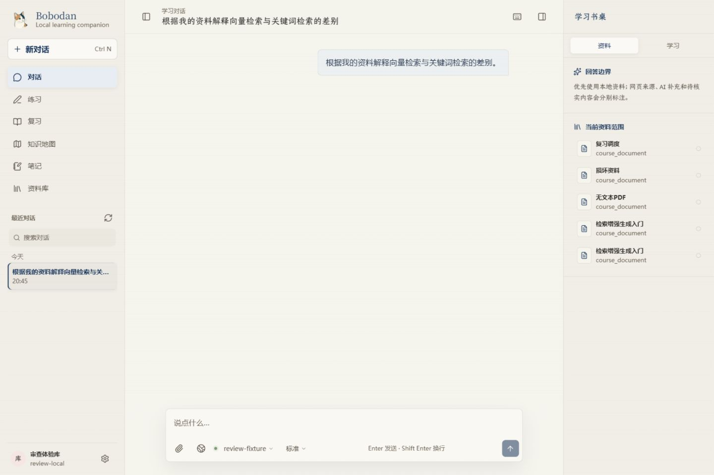
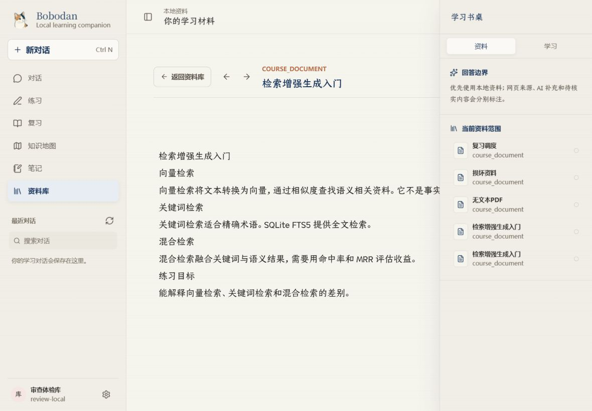
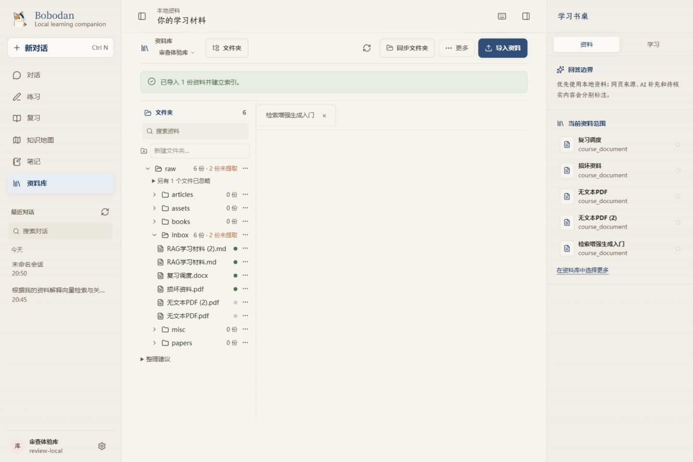
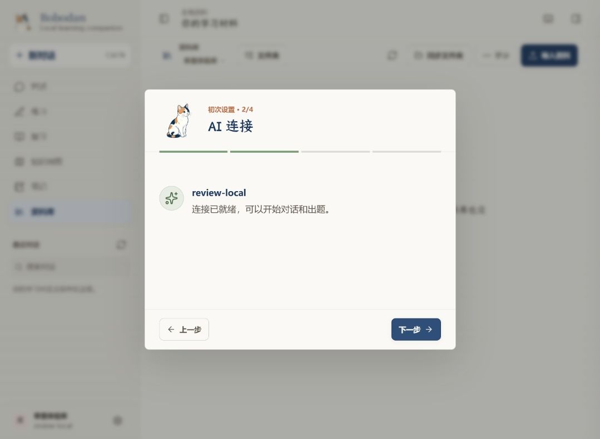
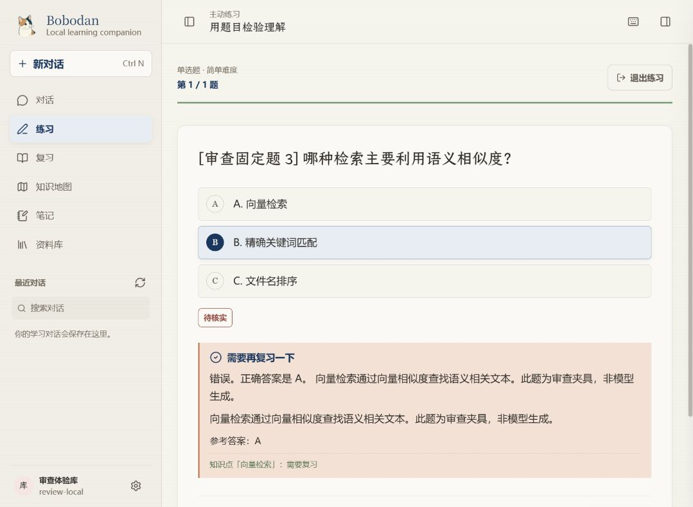

# Bobodan 波波蛋：项目审查与优化报告

- 审查日期：2026-09-25
- 基线审查版本：`f6c3562`，工作区 `project_class`；基线审查本身不修改应用实现。
- 开分支前核对：原分支 `feat/in-page-original-view` 已提交到 `f6c3562`，近期阅读器/滚动条功能及对应记录已完成；除本次审查材料外没有遗留的未提交应用实现。
- 文档核对：原分支的 CHANGELOG 已记录近期界面修复，但 ROADMAP 尚未纳入本次深度审查问题、可行性判断和整改状态，因此先提交审查基线 `95c096f`，再实施修复。
- 审查方式：项目文档与代码阅读、隔离环境中的真实界面操作、真实本地 API 调用、既有自动化测试、针对异常路径的补充验证。
- 结论适用范围：当前 Windows 本地 Web 形态；不是对未来 Electron 安装包的验收。

## 0. 审查整改复验（2026-09-25）

本报告先记录了基线行为，再在分支 `codex/audit-remediation-2026-09-25` 上完成整改。整改范围覆盖 R01–R13；功能修复提交为 `ceb9cc2`，基线审查提交为 `95c096f`。

| 条目 | 整改结果 | 主要验收证据 |
|---|---|---|
| R01 | 已实现 | run_failed、缺终态 EOF、回调异常和成功终态互斥均有 API 回归 |
| R02 | 已实现 | 按资料库/笔记隔离的本地草稿、离开保护、5000 字符计数与保存清理 |
| R03 | 已实现 | 窄桌面取消右缘误触发，目录按钮/关闭入口可用，narrow-desktop E2E 通过 |
| R04–R05 | 已实现 | PDF 解析失败不再走文本回退；TXT 接入；导入结果按可检索/空文本/失败分开 |
| R06 | 已实现 | 文档块数批量聚合并返回到树节点，补充无 N+1 回归 |
| R07 | 已实现 | 引导区分“已保存未验证 / 测试中 / 可用 / 失败” |
| R08 | 已实现 | 手动笔记不受自动记忆开关阻断；编辑器显示 5000 字符限制 |
| R09 | 已实现 | 整理动作先预检冲突；部分失败保留批次与撤销入口；补第二项失败测试 |
| R10 | 已实现 | 评分反馈与解析分层，前端隐藏历史重复解释 |
| R11 | 已实现 | 同一练习题复用辅导 session，切题/换练习时清理关联 |
| R12 | 已实现（范围明确） | 复习返回下一次未来复习时间；完全相同内容默认保留已有，可明确另存副本 |
| R13 | 已实现 | 异步设置加载只补全 Provider，不再重置当前会话草稿、消息与交互卡 |

R12 的“作为新版本”没有作为完全相同字节的默认动作实现：同内容没有新的事实版本；同名不同内容仍按现有安全规则另存为新文件，后续若要覆盖式版本导入，应单独设计版本快照与恢复契约。

最终验收结果如下。基线结果仍保留在第 2.3 节，避免把整改后的绿灯倒写成基线已经通过。

| 验收层 | 结果 |
|---|---|
| 后端 | `1638 passed`，9 条现有 Windows/依赖警告，无失败 |
| 前端单测 | 24 个测试文件、`127 passed` |
| 前端静态门禁 | ESLint 通过；TypeScript 检查与 Vite production build 通过 |
| Playwright | desktop / narrow-desktop / mobile 共 `89 passed`、19 skipped、0 failed；18 个 live 用例需要真实后端，1 个移动端 reduced-motion 用例按配置跳过 |
| 版本与文档 | `git diff --check` 通过；路线图、更新日志和本报告使用同一整改口径 |

## 1. 总体判断

**这个项目已经具备值得继续投入的产品基础，但当前更需要完成可靠性收尾，而不是继续扩张功能数量。** 资料导入、阅读与引用、练习、错题回练、掌握度、知识图谱、笔记、题库等核心组件已经形成体系；大量测试、SQLite 数据底座、前后端共用服务、证据约束，以及本地优先的产品定位，都是实质性的资产。它不是只有界面的概念演示。

站在高频学习者的立场，当前最影响信任的不是缺少动效，而是：失败的对话没有明确结果、未保存笔记会丢失、窄窗口中阅读控件被遮挡、损坏文件可能被当作成功入库。这些问题发生在学习动作的关键位置，会让用户不知道“刚才到底有没有成功”“我的内容还在不在”“这个引用能不能相信”。

建议近期目标改为：**让“导入资料 → 找到证据 → 理解内容 → 做题 → 复习 → 留下笔记”这一条链路稳定、可恢复、可解释。** 当前不建议为了视觉更新重做整体框架，也不建议为桌面化一次性引入全套后台平台。

### 1.1 优先处理的五件事

| 顺序 | 问题 | 为什么先做 | 完成的判断标准 |
|---|---|---|---|
| 1 | SSE 对话失败被前端当成正常结束 | 主功能失败却没有可恢复结果 | 服务商失败、断流、重连失败都显示明确状态；不会进入成功收尾 |
| 2 | 笔记草稿没有离开保护与恢复 | 直接损害用户投入的时间 | 路由切换、刷新、关闭编辑后，草稿可恢复或经过明确丢弃确认 |
| 3 | 窄桌面右侧面板遮挡阅读操作 | 窗口缩放是桌面常见场景 | 1180px 宽下目录、关闭、阅读操作可点击，相关 E2E 稳定通过 |
| 4 | 导入结果与真实解析状态不一致 | 污染知识库并制造虚假成功 | 损坏 PDF 不产生正常知识块；空文本 PDF 不显示“已建立索引” |
| 5 | 批量文件整理的部分失败恢复 | 原始文件操作必须可追溯 | 中途失败能说明已移动项，并可逐项撤销；异常退出后仍可恢复 |

第 5 项是本次发现的代码风险，尚未实际制造中途冲突验证；不应与前四项的已复现结论混为一谈。

## 2. 审查范围、环境与证据

### 2.1 实际做了什么

1. 阅读 README、CLAUDE、项目指南、设计说明和路线图，并核对前端页面、状态管理、流式接口、导入与解析、练习与记忆、SQLite 存储等相关实现。
2. 启动隔离的后端与前端，使用专门的审查资料库；没有使用或修改日常资料库。
3. 从界面创建资料库、导入 Markdown、阅读正文、打开引用、操作笔记、进入题库与练习、提交答案、进入错题复习，并验证离线条件下的回练降级。
4. 检查服务商不可达时的真实对话反馈，导入损坏 PDF 与无文本 PDF，检查格式支持、笔记长度限制和记忆关闭时的写入行为。
5. 用独立的 300 份合成资料库测量同步、目录、文档列表和关键词检索；检查资料库隔离以及移动前后的身份变化。
6. 跑完后端测试、前端静态检查/构建/单元测试和桌面/窄桌面 E2E，并补充两个针对流式异常的失败用例。

### 2.2 必须说明的边界

- 这是一次集中深度体验，不是连续数周的真实学习留存研究；“重度用户视角”来自连续操作、重复任务和异常场景。
- AI 配置故意使用不可达的本地地址，用于检验异常恢复；**没有验证真实商业模型的教学质量、生成题质量、成本、延迟或上下文缓存收益**。
- 练习用的 3 道题由固定测试数据创建，不能把练习流程成功解释为“AI 出题质量已经通过”。
- 检索负载使用合成 Markdown，且为 FTS 路径；没有实测真实 embedding 服务、混合检索收益或 Qdrant 的大规模表现。
- 未验收扫描件 OCR、移动端、Electron 安装/签名/升级、长时间运行、多人并发、整库备份恢复与强制断电恢复。项目本身也没有把移动端列为当前发布验收目标。
- 下文明确区分“实测确认”“代码确认”“代码风险”和“产品建议”。没有测量的数据不写成性能结论。

### 2.3 自动化结果

| 检查 | 结果 | 解释 |
|---|---|---|
| Python：`pytest -q --tb=short` | **1633 passed，9 warnings**，175.20 秒 | 测试基线很扎实；不是零警告，其中包含线程退出时的 Windows socket 警告 |
| 前端 lint | 通过 | 不能替代交互验收 |
| TypeScript/Vite build | 通过 | 当前源码可以完成生产构建 |
| 前端单元测试 | **111 passed / 17 files** | 当前已有用例通过 |
| Playwright desktop + narrow-desktop | **59 passed，12 skipped，1 failed** | 失败项为窄桌面阅读目录按钮被右侧面板遮挡 |
| 单独重跑失败 E2E | **再次失败** | 相同点击被拦截，不能简单归为偶发测试抖动 |
| 补充流式异常用例 | **2 个失败用例复现** | `run_failed` 回调异常被吞；无终态 EOF 仍正常 resolve |

补充用例为审查临时文件，验证后已移除，没有混入应用测试集；这些结果不能与既有的 111 个通过用例合并计算。日志见 [证据目录](evidence/2026-09-25/)。

## 3. 已经做得好的部分

- **产品主线清楚。** 阅读、引用、练习与复习围绕同一资料库组织，适合长期积累，而不是一次性聊天工具。
- **信息来源有技术约束。** 证据引用、服务端校验和概念确认机制比只在提示词里要求模型“不要胡说”更可靠，应保留。
- **基础数据结构具有延展性。** SQLite 作为主要事实来源、共享 Python 服务、独立检索层，使 CLI/Web 的能力可以复用；没有必要为新 UI 重写后端。
- **离线降级已有价值。** 变式题生成不可用时，界面说明原因并退回原题，实测能够完成错题回练。FTS 也使系统不必依赖 embedding 才能使用。
- **成熟功能比路线图第一眼呈现得更多。** 题库、收藏/题集相关能力、复习中文状态、逐题回顾、流式序列去重和部分恢复、后台任务与用量记录等已有实现或基线，不应再从零规划。
- **视觉方向有辨识度。** 温暖纸色、墨蓝、低饱和辅助色和阅读型字体适合学习产品；应改善密度与层级，避免换成普通管理后台。
- **工程纪律有基础。** 已有 Windows CI、前端构建/测试与 E2E；依赖锁文件存在。问题主要是关键异常路径覆盖不足，不是没有工程体系。

## 4. 按优先级排列的问题清单

优先级说明：P0＝建议作为下一次公开发布前的阻断项；P1＝显著影响常用体验或数据可靠性；P2＝在主链路稳定后推进。这里的 P0 不表示已经发生安全事故。

### R01｜P0｜对话运行失败被当作正常结束

**证据等级：实测确认 + 代码确认 + 定向失败用例。**

在服务商不可达时发送问题，后端 SSE 先返回 `run_started`，随后明确返回 `run_failed`。前端结束等待并切换到会话，但只留下用户消息，没有稳定可见的失败解释与恢复入口。

根因位于 [api.ts](../../web/frontend/src/lib/api.ts) 的 `streamChat`：派发 `run_failed` 时先将 `terminal` 置为真，之后调用事件回调；`useChatStream` 抛出的运行失败被读取循环捕获为 `networkError`，最终仅在 `!terminal && networkError` 时再抛出，导致本次失败正常 resolve。清洁 EOF 缺失终态也会被接受。

**优化：** 分别建模“传输是否结束”和“业务运行是否成功”；`run_failed` 必须产生失败结果，回调异常不能因已收到终态而消失。没有终态的 EOF 应转入中断/恢复流程，不能默认为成功。失败摘要应留在会话中，不只出现瞬时 toast。保留现有序号去重和恢复能力。

**验收：** 服务商拒绝、超时、SSE 失败终态、无终态断流各有明确状态；重试不重复落库；恢复不重复渲染；成功/失败收尾互斥；刷新后能理解上一轮发生了什么。

### R02｜P0｜笔记草稿在切换页面后丢失

**证据等级：实测确认 + 代码确认。**

在笔记页输入新笔记但不保存，进入复习后再返回，编辑内容消失，没有离开提示或恢复入口。[NotesPage.tsx](../../web/frontend/src/pages/NotesPage.tsx) 的草稿主要保存在组件 `useState`，关闭编辑与 Escape 也会清空状态。

**优化：** 草稿按资料库和笔记标识隔离，防抖保存到本地草稿层；离开/关闭时提供保存、保留草稿、丢弃等清晰选择。已发布笔记与临时草稿应有明确区分，避免把每次输入都悄悄覆盖为正式内容。

**验收：** 路由切换、刷新、Escape、编辑器关闭分别有测试；恢复内容不串库；保存后清理对应草稿；放弃操作需要用户明确选择。

### R03｜P0｜窄桌面阅读控件被右侧面板遮挡

**证据等级：实测确认 + 既有 E2E 连续两次失败。**

1180×820 窗口下，右侧上下文面板覆盖阅读区右边缘，目录按钮的点击被面板拦截。现有 `e2e/app.spec.ts` 中“目录从工具栏打开”的用例失败，单独重跑结果相同。

[styles.css](../../web/frontend/src/styles.css) 中窄布局的固定定位、层级和关闭入口需要一起检查。不要仅给测试增加强制点击或更长超时，那会绕过真实用户问题。

**优化：** 明确“宽屏并排面板 / 窄屏抽屉”的切换规则。抽屉必须有始终可见的关闭按钮、遮罩、Escape 和合理焦点管理；或者压缩中央内容，但不能覆盖关键按钮。鼠标靠近边缘不应意外打开面板。

**验收：** 至少在 1080、1180、1440 像素宽度下完成打开目录、关闭面板、跳转引用、返回阅读；按钮不被覆盖，键盘可操作，现有失败用例稳定通过。

### R04｜P0｜损坏 PDF 被文本回退误判为成功入库

**证据等级：实测确认 + 代码确认。**

将 17 字节的普通文本命名为 `.pdf` 上传，接口返回成功、1 个知识块、`error_files=0`、`extraction_status=complete`。PDF 解析器本来已识别签名错误，但 [obsidian/sync.py](../../obsidian/sync.py) 在没有解析段落时调用通用文本回退；文本读得出来便重新生成成功的提取报告。

**优化：** 文本回退仅适用于明确支持的文本格式；二进制/结构化文档解析失败要保留失败分类，不能被另一条通路覆盖。文件接收、格式校验、正文提取、索引建立应分别记录结果。

**验收：** 伪 PDF、截断 PDF、真实无文本 PDF、正常 PDF 四类样本分别得到格式错误、解析错误、无可提取文本、成功；前两者不产生正常可检索知识块；用户能重试或移除失败项。

### R05｜P1｜导入提示夸大成功，格式支持不一致

**证据等级：实测确认 + 代码确认。**

真实的无文本 PDF 被正确标记为 `empty`、没有知识块，但界面仍提示“已导入 1 份资料并建立索引”。[AppShell.tsx](../../web/frontend/src/components/AppShell.tsx) 的提示主要依据导入文件数，没有完整表达解析结果。README 宣称支持 TXT，界面文件选择器和导入服务允许列表却不包含 `.txt`；TXT 探针也被拒绝。

**优化：** 把“接收了文件”与“可以用于回答/出题”分开。逐文件显示完整、部分提取、无文本、失败与原因；汇总显示“1 份接收成功，0 份可检索”。TXT 要么真正接通，要么同步修正文档。导入取消应明确是停止后续处理还是删除已接收文件。

**验收：** 混合上传正常、空、损坏、不支持格式时，四类状态准确；提示与服务端结果一致；重复点击不造成重复任务；取消后状态可解释。

### R06｜P1｜资料树的知识块数量错误显示为 0

**证据等级：API/界面实测 + 代码确认。**

有正文、有检索结果的资料，在目录树仍显示 0 个知识块。[KBService.tree](../../service/kb_service.py) 从 `list_documents()` 返回项读取 `chunk_count`，但 [sqlite_store.py](../../rag/sqlite_store.py) 的相关文档查询没有提供这个聚合字段，因此落入默认 0。索引并没有丢失，是展示契约有误。

**优化：** 让文档列表/资料树的 DTO 明确包含块数，采用批量聚合查询；不要为每个文件单独查一次。不要把解析页数或提取单位数直接冒充知识块数。

**验收：** 树、详情和数据库的块数一致；删除、同步、重建后更新；300 文件下没有新增 N+1 查询。

### R07｜P1｜“连接已就绪”其实只说明填写了配置

**证据等级：实测确认 + 代码确认。**

首次引导在假密钥、不可达服务地址下仍显示“连接已就绪，可以开始对话和出题”。[OnboardingDialog.tsx](../../web/frontend/src/components/OnboardingDialog.tsx) 主要依据 `configured` 判断，不能证明服务商可访问或模型可用。

**优化：** 区分未配置、已配置未验证、验证成功、验证失败；显示最近验证时间，并提供有超时限制的连接检查。检查结果应区分地址不可达、鉴权失败、模型不存在和额度不足。

**验收：** 仅填配置不出现已验证措辞；离线引导仍能说明可用的阅读/检索功能；失败不会让用户必须重新走完整引导。

### R08｜P1｜关闭 AI 记忆连带阻止手动笔记；长度限制不可见

**证据等级：API/界面实测 + 代码确认；交互调整属于产品建议。**

关闭学习记忆后，手动创建笔记返回 409 `memory_disabled`。[memory.py](../../web/backend/routers/memory.py) 对手工笔记写入复用了记忆写入开关。另一次 5200 字符笔记写入返回 422，后端上限为 5000，前端没有对应计数与限制说明，错误信息偏技术化。

**优化：** 明确拆分“允许 AI 自动形成长期记忆”和“用户主动写笔记”。关闭自动记忆通常不应剥夺手工记录能力；如果产品坚持绑定，必须在设置与编辑入口直接说明。长笔记应提供剩余字数或调整存储契约，不能等提交失败才告诉用户。

**验收：** 开关的影响范围可预测；长内容提交失败不会丢草稿；用户错误中文化且指向可执行下一步。

### R09｜P1｜批量文件整理可能部分成功却没有完整撤销记录

**证据等级：代码风险，未实测制造部分失败。**

[KBService.apply_organization](../../service/kb_service.py) 在循环中依次移动文件，某项失败便立即返回；批次记录在循环完成之后才保存。这意味着前面已经成功移动的文件，可能因后面失败而缺少完整批次撤销记录。文件系统与 SQLite 也不是同一个事务。

**优化：** 先做路径/重名预检，再持久化操作计划；每项记录待执行、已执行、失败、已撤销。中途出错时返回已完成项及恢复入口；异常退出后可据日志继续或补偿。不要把“所有失败都自动回滚”当成无需验证的承诺。

**验收：** 至少覆盖第二个文件重名、权限拒绝、移动后索引失败、进程中止、撤销目标又被占用；任何部分变更都可以被发现和解释。

普通单文件移动在本次测试中保持了 `doc_id`。知识块 ID 随路径变化，再移回可恢复原值；这不是单凭观察就能判定的引用损坏，但需要对旧引用、会话深链接与题目来源做迁移回归。

### R10｜P2｜判题反馈与解析重复，占用主要阅读空间

**证据等级：界面实测。**

错误作答后的反馈区重复呈现相同解释，正确答案与解释层级也不够清楚。当前 [PracticePage.tsx](../../web/frontend/src/pages/PracticePage.tsx) 同时展示反馈和解析，而它们可能已包含相同文本。

**优化：** 明确反馈结构：结论、关键原因、完整解析、资料证据；不要用前端字符串去重掩盖接口语义不清。默认先呈现为什么错，完整解析按需展开，支持直接回到原文。

**验收：** 客观题与主观题各有不重复的展示契约；答对、部分正确、答错均可快速理解；不根据颜色单独传达结果。

### R11｜P2｜练习追问可能不断制造新会话

**证据等级：代码确认，未用真实模型连续对话验证。**

`PracticePage.askAi` 调用 `streamChat` 时没有复用会话 ID，后续还会刷新会话、生成标题。这使“同一道题连续问两句”可能分裂成多个聊天会话，稀释会话列表，也失去连续辅导的上下文。

**优化：** 按本次练习与题目持有明确的辅导会话；从服务端题目 ID 取可信上下文，避免只拼接当前界面文字。允许用户显式转为独立聊天。

**验收：** 同题连续追问保留上下文且不重复建会话；切题/换库不串上下文；刷新后能恢复关联。

### R12｜P2｜复习结果缺少解释，重复导入缺少决策

**证据等级：实测行为 + 产品建议。**

错题回练答对后，错题数归零但薄弱项仍保留，历史正确率也仍影响展示。这不一定是算法错误，但用户需要知道“已经纠正本次错误”和“长期掌握仍需巩固”的区别。当前空待复习页也可以更明确地展示下一次到期时间。

同一 Markdown 再次上传会创建带 `(2)` 的文件，生成新文档 ID，但内容哈希相同。这避免覆盖，却会给重度用户带来重复资料、重复证据与目录噪音。

**优化：** 复习页说明状态来源与下一次行动；重复内容导入时提供保留已有、作为新版本、另存副本的选择，不自动合并可能有意独立的原始资料。

**整改复验：** 复习接口现在返回最近的未来复习时间，空队列会显示下一次复习知识点；页面解释“错题”与“薄弱点”是两个不同统计口径。导入服务按内容哈希识别完全相同文件，默认保留已有版本，并在资料库页提供明确的“另存副本”动作；同名不同内容继续安全地生成新文件，不覆盖原件。

## 5. 前端 UI、UX 与动效建议

### 5.1 阅读页：让正文成为默认焦点

当前窄窗口中，左资料树、页面标题与元信息、右上下文面板同时占据空间；正文首屏面积偏小。嵌入阅读与独立 Reader 的头部表达也存在重复。建议优先改善信息层级，不要靠缩小全局字号塞内容。

- 一级保留资料标题、当前位置、返回与目录；文件类型、统计、摘要折为次级信息。
- 阅读模式允许收起左右栏，记住用户在当前布局下的选择；引用跳转后定位证据并给短暂、温和的高亮。
- 将“回到提问/练习”作为引用阅读的主要返回动作，保留正文位置；不要让用户通过浏览器回退猜测返回路径。
- 大文档目录支持章节定位；标题多时维持目录内部滚动，不让整个页面同时出现多个难以辨认的滚动区域。

相关截图：[窄阅读布局](assets/2026-09-25/02-reader-narrow.png)、[引用阅读](assets/2026-09-25/03-citation-reader.png)。

### 5.2 聊天：优先解释工作状态

用户需要区分正在检索、等待服务商、生成回答、等待自己确认、已停止和运行失败。每种状态应有对应动作：取消、重试、回答问题、查看资料或修改设置。不要把所有状态包装成一个持续闪动的“思考中”。

已有过程折叠与恢复能力应整合到同一套运行状态中，避免一个位置显示完成、另一个位置还在转圈。长任务可显示已完成的可验证阶段，不需要暴露内部推理。用户向上阅读时停止自动跟随，新内容以轻提示呈现；返回底部后再恢复跟随。

### 5.3 练习与复习：减少同屏竞争

建议固定视觉顺序为题干 → 作答 → 判题结论 → 原因/证据 → 下一步。题库筛选、管理与学习操作保持清楚分层；窄窗口的按钮文字不要挤成多行小块。用键盘可以提交、进入下一题，但输入长答案时避免误触全局快捷键。

现有中文状态、变式失败降级和逐题回顾应该保留。优先补上“下一次复习什么时候”“为什么仍算薄弱”“此次练习是否保存”的解释，再考虑庆祝动效或更复杂的掌握度环。

### 5.4 笔记与设置：状态要看得见

笔记编辑器应显示未保存/草稿已保留/保存失败，并提供字数说明。设置页中立即生效的开关与需要点击保存的配置要在视觉上区分；不能只靠某些页面有按钮、某些页面没有让用户猜测。错误提示用中文说明可执行下一步，保留可复制的技术细节供排障。

### 5.5 动效：现有基础够用，重点是语义与可打断

项目已有约 120/160/220ms 的时长层次、spring 工具、CSS 动效和 reduced-motion 处理，不需要为了“高级感”新增大型动效库。

| 场景 | 建议 | 不应发生 |
|---|---|---|
| 侧栏/抽屉 | 短过渡，关闭入口从第一帧可用，焦点正确转移 | 动画期间按钮不可点、遮挡不明确 |
| 引用定位 | 短暂背景强调与必要滚动，尊重减少动态效果设置 | 反复跳动、强制把用户拉回底部 |
| 流式文字 | 稳定布局、分批更新、代码块与 Markdown 不频繁整段重排 | 每个 token 触发昂贵重渲染 |
| 判题反馈 | 结论先出现，解释随后自然展开 | 长庆祝动画阻挡下一题 |
| 导入/后台任务 | 展示真实阶段与可取消状态 | 无进度依据的循环动画暗示任务正常 |

本次没有录制帧时间或测量 FPS，不能据主观体验宣称“已达 60fps”。性能优化应以长回答、代码块、大文档和低配置机器的实际 profile 为依据。

### 5.6 可访问性与桌面适配

本次开发控制台还出现了资料树 `li` 直接嵌套 `li` 的 React 警告，调用栈指向 `LibraryTree/TreeFolder`。应修正为合法列表/树分组结构，并回归键盘操作。这是已观察到的结构警告，不等于本次已经发生页面崩溃。

补齐搜索框、笔记标题/正文等控件的可访问名称；验证焦点可见、Escape 关闭、抽屉焦点返回、键盘顺序和状态播报。优先覆盖窄桌面及缩放场景，而不是为了当前范围之外的移动端重构全部布局。本次不是完整 WCAG 审计，没有测量所有颜色对比度。

## 6. 后端、数据与检索建议

### 6.1 用少量明确状态解决可靠性问题

对话运行、导入、索引和文件整理都应有持久化的成功/失败/中断结果，但不必立即抽象成通用分布式任务平台。先统一最关键的运行记录、错误分类、幂等键、取消语义与恢复入口，再判断哪些后台能力真正适合共用调度。

用户看到的成功应该对应可验证结果：文件收到不等于索引成功，SSE 连接关闭不等于运行成功，按钮返回不等于所有文件均已移动。

### 6.2 保持单一事实来源与可迁移身份

SQLite、会话历史、事件日志、向量索引、原始文件各有作用，迁移前要明确谁负责最终状态。向量索引应是可重建派生数据；不要让 JSONL 与数据库各自成为独立真相。文件移动、重建索引和资料更新时，持续验证文档、块、题目和引用之间的身份映射。

整库备份必须覆盖原始资料、数据库、题目/笔记、必要配置和版本信息，并实际做恢复演练。题库导出或备份不能代替整库恢复。不要把密钥未经处理地打入可分享的备份文件。

### 6.3 导入容量与重复处理

现有单文件 25MB 限制有帮助，但路由会聚合读入文件内容；还应制定每批总量、文件数与并发处理上限。这里是代码层面的容量风险，本次没有做内存耗尽测试。先测量，再选择分批、流式写盘或任务排队，不需要立即引入大规模队列基础设施。

重复内容应提供决策入口；索引可以复用内容哈希，但是否合并原始资料必须由产品语义决定。取消与重试应避免重复生成块或留下“半成功但显示完成”的文档。

### 6.4 检索评估优先于参数堆叠

FTS 是当前可用性底座，应保持一等公民地位。为真实课程建立 20–50 个初始问题集，标注相关文档/块，比较 FTS、向量与混合检索的 Hit@5、MRR 和答案引用正确率。没有评测集之前，不能证明增加向量权重、重排或扩大上下文真的改善学习。

生成题评估还需检查来源可追溯性、答案唯一性、题干歧义、难度、重复率、解析质量与对抗性资料；不能只以 JSON 解析成功或题目保存成功作为验收。

### 6.5 本次规模探针

| 项目 | 本地隔离探针结果 | 可以得出的结论 |
|---|---|---|
| 300 份 Markdown / 12 个文件夹 | 同步约 9.05 秒，3900 块，错误 0 | 合成数据下基础批量同步可完成 |
| 资料树，7 次请求 | 中位约 58.4ms，最大约 65.5ms；约 78.7KB | 这一规模的树接口没有显著延迟问题 |
| 文档列表，7 次请求 | 中位约 89.9ms，最大约 98.7ms；约 578.4KB | 响应携带较多资料信息，可按实际需要减少列表负载 |
| 检索，7 次请求 | 中位约 102.2ms，最大约 1971.6ms | 存在单次较慢请求，样本不足以定性原因或计算可靠尾延迟 |
| 指定合成关键词 | 命中预期资料，结果标记 FTS | 说明这条关键词路径工作，不证明真实课程检索质量 |

以上是开发环境、小样本、合成数据、单用户探针；不是压力测试，不代表 p95、冷启动、并发能力或真实 AI 延迟。不要据此立即引入虚拟列表、缓存层或替换数据库。

构建产物观察：CSS 约 651.07KB / gzip 196.95KB，主 JS 约 293.01KB / gzip 89.84KB，图谱块约 208.81KB / gzip 52.54KB；已有拆包。建议先分析 CSS 来源与实际覆盖率、首屏和长内容渲染，再决定精简范围。文件体积本身不是掉帧证据。

### 6.6 维护性：按改动边界拆，不做大重构

`kb_service.py`、`LibraryPage.tsx`、`ChatPage.tsx` 已明显偏大。建议在修复对应问题时提取纯状态转换、导入结果映射、文件操作计划等可独立测试的单元，避免一次性改变页面结构、接口和数据模型。维持现有 UI 风格与服务层契约，降低回归风险。

## 7. 路线图逐项判断

### 7.1 先整理路线图的“事实层”

路线图包含不同时间的历史计划与完成记录，版本头仍写 2026-09-08，却包含后续多轮更新；项目指南仍有较早的下一阶段说明。同一能力在旧段落写待开发、后段落写完成，容易误导排期。W5 入口和执行章节的发布门槛也不完全一致。

建议每项保留：当前状态、代码/测试证据、剩余工作、依赖、验收条件、最近确认日期。状态至少分为已实现、部分实现、待实现、待验证、暂缓。**功能有代码不等于体验验收通过；出现回归也不等于整个功能都没有实现。**

以下“可行”表示与现有架构兼容，不是工期承诺。复杂度是相对判断，受真实模型、数据迁移和测试深度影响。

### 7.2 W1：学习闭环 E1–E18

| 项目 | 当前判断 | 可行性与建议验收 |
|---|---|---|
| E1 错误处理 | 有基线，但 R01 重新暴露阻断问题 | 高可行、最高优先；必须覆盖业务失败终态与断流，不只 HTTP 错误 |
| E2 资料库默认路径 | 界面已有默认路径与解释 | 不应重做；补路径权限、已有目录、中文路径回归即可 |
| E3 错题变式与降级 | 已有，离线退回原题实测成功 | 保留；再用真实模型验等价知识点、答案与来源，不能只验三次重试 |
| E4 ask_user 持久化 | 注册、等待/回答等契约已有基础 | 可行；剩余重点是多问题导航、刷新恢复和等待用户状态，不重造协议 |
| E5 Explore→Plan→逐题流式 | 当前批量生成后保存，目标尚未完整达成 | 可行但中高复杂度；先保存单题且通过校验，再发 ready 事件；取消后已成题可保留 |
| E6 独立掌握度引擎 | 当前调度与状态已有，规划纯引擎未完整落地 | 可行；规则可解释、历史可迁移。近五次权重与置信上限属于假设，须用学习数据校准 |
| E7 高亮与笔记锚定 | 引用定位有基础，持久批注未形成完整闭环 | 可行但锚点有难度；先用文档版本、块、引用文本校验；更新后明确标记失效锚点 |
| E8 导入进度/失败/取消 | 有处理流程，用户结果契约不完整 | 高优先；先修 R04/R05，再补逐文件阶段、取消与重试，不画虚假百分比 |
| E9 到期复习与状态 | 中文状态、原题回练已有 | 可行；补下一次到期、薄弱原因与长期连续性，复用 E3 |
| E10 苏格拉底式技能 | 可利用现有技能/提示词能力 | 技术可行、教学效果待评；用教学样例验收，不让风格规则越过证据与写入约束 |
| E11 AgentLoop 收尾契约 | 循环/预算/收尾机制已有部分基础 | 可行；用预算耗尽、工具失败、用户中断等契约测试推进，不先重写框架 |
| E12 稳定提示词与预检索 | 提示词布局及测试已有基础 | 可行；记录 token、首字延迟和引用质量后再宣称缓存/成本收益 |
| E13 练习卡保护 | 服务端绑定与既有测试已有 | 保留并回归；不要新增绕开服务端约束的聊天出题路径 |
| E14 练习追问上下文 | R11 所述缺口仍在 | 高可行、中等收益成本比；一个练习/题目关联一个持续辅导会话 |
| E15 三态判题 | 已有实现与测试 | 重点是真实模型评分稳定性、rubric 和重复解释，而非再加一次三态枚举 |
| E16 新概念定位高亮 | 图谱编辑与关联有基础，完整确认流本次未验收 | 可行；只突出已确认概念，确认后定位可撤销、不打断阅读 |
| E17 文件树/移动/组织 | 已有较完整实现，旧的“只读”描述过时 | 继续可靠性收尾：数量准确、身份迁移、部分失败日志与撤销，不再按从零建设排期 |
| E18 题库 S1–S7 | 代码与完成记录已有较完整能力 | 以回归和剩余 Web 概念候选衔接为主；整库备份单独列项，不能以题库备份代替 |

**E6 的关键产品风险：** 调度间隔、掌握状态和展示分数应有一致解释。当前“连续答对若干次即 mastered”与逐次小幅增加的分数，可能让用户同时看到“已掌握”和低百分比。先定义它们各自代表什么，再定计算公式。

**E7 的关键技术边界：** 字符偏移并不能稳定覆盖排版变化、PDF 重提取和扫描件。先让稳定文本资料的批注可靠，再讨论 OCR；不要承诺所有文档的高亮都能无损迁移。

### 7.3 W2：检索与解析 G1–G5

| 项目 | 当前判断 | 可行性与建议 |
|---|---|---|
| G1 API embedding / Ollama | 提供商与模板基础已有，设置体验和真实链路仍需验 | 可行；明确独立于聊天模型的配置，显示检测结果；FTS 不应因向量不可用而失效 |
| G2 签名、维度与增量 | 已有模型签名、维度/批次校验、429 重试、部分回填机制 | 不是全新任务；验证断点、换模型重建和大批次取消。旧段落把已实现的 429 重试当待办应更新 |
| G3 运行级超时/心跳 | 存在提供商超时基础；规划的运行级守卫本次未验收 | 可行；全局截止时间、无进展检测与取消分开，不能把慢任务一律当死任务 |
| G4 检索评测 | 缺少本次可用于质量判定的真实标注基准 | 应前置；先有小而可靠的问题集，再调混合权重与排序 |
| G5 PDF 多层回退 | PDF 解析与无文本识别已有基础，但 R04 破坏错误语义 | 有条件可行；先修错误保留，再逐级评估目录/标题回退，扫描 OCR 单列成本与依赖 |

### 7.4 W3：前端状态与交互

| 项目组 | 当前基础与缺口 | 建议 |
|---|---|---|
| F1 纯状态 fold | 当前仍有事件回调副作用；已有 seq 去重 | 可行。先修 R01，再将转换集中；不能同时维护两份权威状态 |
| F2 收尾协议 | 已有运行协议，所有收尾分支未完全验收 | 与后端定义明确终态；不要用模型文本或正则猜是否完成 |
| F3 事件订阅契约 | 有事件/派生状态基础 | 审计事件常量与消费方，增加穷尽性和兼容测试，避免只换命名 |
| F6 自适应打字机 | StreamBuffer 等机制和测试已有 | 对长 Markdown 实测后调整刷新节奏；避免文字缓冲与流状态互相覆盖 |
| F7 滚动单一控制 | 滚动、观察器与程序滚动相互影响的风险存在 | 用统一滚动意图模型处理用户上滚、尺寸变化、返回底部；需真实流式压力验收 |
| F8–F10 过程展示 | ProcessFold/分组等已有 | 优先状态准确、可折叠、可取消；只显示可验证工作阶段，不展示内部推理 |
| F11 多问题页签 | 依赖 E4，部分交互仍需完善 | 保留各题草稿、明确必答项、支持返回；不要切页签就清空输入 |
| F12 等待用户时的输入器 | 可实现 | 允许明确取消/返回；避免把所有场景强制锁死成问卷 |
| F13 逐题卡片 | 依赖 E5 与稳定题目/运行 ID | 后端持久化事件先行；前端不能用动画模拟未完成的逐题生成 |
| F14 字体/设计 token | 已有规则与相关测试 | 以页面一致性和阅读密度收尾，不再整体换皮 |
| F17 mock SSE | 已有不少 mock 与 E2E | 加入失败终态、缺终态、重复事件、乱序/重放和取消，不只幸福路径 |
| F19 页面规范收敛 | 已有历史完成记录 | 以实际宽度/交互验收兜底；token 测试通过不能替代 R03 的可点击性 |
| H-a 复制/重试/编辑重发 | 复制、重试已有部分能力 | 逐项补差；编辑重发需定义分支历史与引用，避免覆盖旧消息 |
| H-b 会话搜索/时间线 | 可行 | 对重度使用价值较高，通常比新装饰动效更值得前置 |
| H-c 统一通知 | NoticeCenter 等已有 | 统一通知来源与持久错误入口；不要同一失败弹多处，又让关键失败没有结果 |
| H-d 输入器内联 @ / CodeMirror | 可行但依赖、中文输入与可访问性成本较高 | 暂缓，先用最小引用选择交互验证需求，再决定编辑器依赖 |
| H-e 版本 diff | 版本与编辑基础已有 | 可行；先保证版本身份和恢复语义，再做对比界面 |
| H-f spring/列表动效 | spring 基础已有 | 按高频场景增量使用，不引入全局重排动画 |
| FE-P2 F4 恢复/重连 | RunPump、事件日志与恢复已有部分 | 把失败语义和基本恢复升为近期可靠性事项；ACK/追平守卫按实际缺口补齐 |
| FE-P2 F5 乐观 ID | 可行 | 先证明现有确认延迟或重复消息问题，再做关联与去重，不仅为动画速度引入复杂性 |
| FE-P2 F15/F16 | 空状态组件、模块化基础已有 | 空状态给下一步；纯状态提取随目标问题推进，不做全库重构 |
| FE-P2 F18 庆祝/掌握环 | 可行但低优先 | 短暂、不阻塞、尊重 reduced-motion，不能让装饰掩盖掌握度含义不清 |

### 7.5 W4：后台能力、记忆与运行治理

| 项目 | 判断与主要风险 | 建议做法 |
|---|---|---|
| H-R2.1 提醒 | 打开网页时可行；浏览器关闭后的可靠通知有运行环境前提 | 先做应用内到期提醒；需要后台常驻/系统调度时单独设计，不承诺纯页面关闭后仍可靠运行 |
| H-R2.2 用量账本 | UsageService 已有基础 | 完善成功、失败、重试、缓存等归因；明确服务商返回值与估算值区别 |
| H-R2.3 后台任务 | 多种后台/恢复任务已经存在 | 从共同日志、幂等和可取消契约整合，先做最小本地 job 机制 |
| H-R2.4 记忆归并 | 归并与候选确认已有基础 | 用户手动笔记不得被自动覆盖；写入可解释可撤销，成本与隐私有明确设置 |
| H-R2.5 按需工具 schema / BM25 | 技术可行，收益未实测 | 先测上下文成本；工具发现不能代替权限与写入授权检查 |
| H-R2.6 会话压缩 | 已有 token 预算式 compactor | 重点验证边界与关键事实保留，不退化为固定“30 条就压缩”的简单规则 |
| H-R2.7 事件日志/JSONL | 事件日志存在，会话存储也已有事实来源 | 先定义恢复一致性，避免新增双重事实来源；迁移必须有回滚与旧数据读取策略 |
| H-R0.7 epoch / schema gate | 对正式升级重要 | 提前做版本检查、迁移前备份、事务与未来版本保护；文件变更使用可恢复日志 |
| O7/O8 技能契约与个人技能 | 与现有架构兼容 | 机器可校验作用域和写入边界；避免把记忆、偏好和技能保存成互相冲突的三套内容 |

### 7.6 W5：桌面化是否能实现

**可以实现，但“能打包”与“能可靠发布”是两件事。** 当前本地 Web 架构适合在 Electron 中启动 Python sidecar，不过主要风险会转移到进程生命周期、数据目录、迁移、安装与升级。

建议顺序：

1. 先把上述 P0、基本数据恢复和迁移门槛完成；将一个可靠的本地 Web 版本作为基线。
2. 验证 sidecar 启动握手、端口冲突、重复启动、崩溃重启、退出清理；不能误杀用户其他 Python 进程。
3. 明确本地 API 的访问边界、来源/令牌机制与 Electron 权限；这是发布设计要求，本次没有证明存在可利用漏洞。
4. 实测中文路径、非管理员、只读目录、不同 DPI、离线启动、低配置设备、数据目录迁移。
5. 签名证书、发布主体和更新渠道作为实际依赖管理；升级前备份、原子替换、失败回滚、旧数据兼容各有演练。

把 W5 发布门槛统一成一份清单。若产品允许 FTS-only 模式，外部向量服务不应该无条件成为安装版发布的前置条件；但若宣传了某提供商支持，就必须验收那条真实链路。

### 7.7 建议暂缓与不建议承诺的内容

- 暂缓：高级输入器、全局列表动画、复杂庆祝系统、未测收益的工具检索、通用后台平台重构。
- 不建议承诺：任意 PDF 无损解析、任意更新后的批注永久精确锚定、纯网页关闭后的可靠定时任务、没有真实数据校准的科学掌握度百分比。
- 需要产品决策：Wiki 的停用/保留描述与当前 README、设置入口仍有不一致；应明确是维护旧数据还是继续提供能力，不能静默删除历史数据。

## 8. 建议的实施批次与发布验收

本报告不提供未经团队产能验证的固定日期承诺。按依赖拆成四个可验收批次，比继续堆叠跨月功能清单更可控。

| 批次 | 内容 | 验收后能给用户什么 |
|---|---|---|
| A：可信结果 | R01–R05、R07、R09、R13 | 每次操作的成败可见，草稿安全，阅读可操作，坏资料不误入库 |
| B：高频效率 | R06/R08/R10–R12、阅读布局、E14、导入重试 | 减少重复劳动、状态困惑和上下文丢失 |
| C：学习效果 | G4 评测、E5 分段产出、E6 解释性、E7 稳定锚点 | 质量有依据，学习链路更连续 |
| D：可交付与可升级 | 整库备份恢复、schema gate、后台恢复、W5 sidecar/安装升级 | 可以让真实用户长期保存资料并安全升级 |

### 最小发布门槛

- [x] 后端、前端与桌面/窄桌面 E2E 全部通过；跳过项有明确原因。
- [x] SSE 成功、失败、取消、缺终态、恢复/重放有独立回归，不出现失败当成功。
- [x] 草稿在导航、刷新、关闭编辑时可保留，提交错误不会丢内容。
- [x] 正常、空、损坏和不支持文件的导入状态准确，异常文件不形成有效证据。
- [x] 窄桌面所有关键操作可点击、可关闭、可用键盘到达。
- [x] 文件批量操作部分失败可追踪并可恢复，旧引用迁移有回归。
- [ ] 整库备份在新目录中实际恢复成功，数量和关键引用一致；不只验证压缩包能打开。
- [ ] 用真实模型完成至少一套“资料→回答→题目→判题→复习”的质量验收，并记录模型/配置。
- [x] 路线图中的已实现、待验证和计划功能不再混写，发布说明与实际支持格式一致。

## 9. 证据与后续工作的使用方式

本报告中的建议应转化为小范围 issue，每项带重现步骤、预期/实际行为、验收测试和对应实现路径。优先把 R01、R02、R03、R04 转成可稳定失败的回归，再修复；不要为了让测试绿而删除真实交互约束。

### 关键实现位置

- 流式收尾：`web/frontend/src/lib/api.ts`、`useChatStream`、`ChatPage`。
- 笔记：`web/frontend/src/pages/NotesPage.tsx`、`web/backend/routers/memory.py`。
- 导入与提示：`AppShell.tsx`、`service/kb_service.py`、`obsidian/sync.py`、`rag/parsers/`。
- 资料树：`service/kb_service.py`、`rag/sqlite_store.py`、`LibraryTree`。
- 练习：`web/frontend/src/pages/PracticePage.tsx`、练习/判题/复习服务。
- 布局与动效：`web/frontend/src/styles.css`、`AppShell`、滚动与 StreamBuffer 实现。
- 规划：`docs/ROADMAP.md`、`docs/PROJECT_GUIDE.md`、`docs/DESIGN.md`、`README.md`。

### 证据文件

- [测试与 API 证据目录](evidence/2026-09-25/)：测试输出与隔离环境探针。
- [界面截图目录](assets/2026-09-25/)：9 张真实界面截图，均来自专门的审查资料。
- 界面、API 与代码相互印证的条目已标注；仅代码推断的风险须先补复现，不能直接当成已发生事故。

本次交付包含审查基线 `95c096f`、功能整改 `ceb9cc2`、自动化验收与对应文档。真实模型教学评估、整库备份恢复、持续使用研究和 Electron 发布验收仍是明确的后续工作，不在本次已完成范围内。
